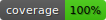

# Description

developed with golang 1.16

Simple pooling implementation using a `strings.Builder`.  
In this case, the pool allows you to organize the work and reuse of several strings.Builder structs.

## Advantages

- Realization allows to set the size of the pool, while protecting against negative and zero values.
- Realization allows to use context for timeouts.
- It easy to replace `strings.Builder` with another one (writers/readers e.t.c)

## Disadvantages

- Too simple example.

## Code example

[check code here](builder/example_test.go)
